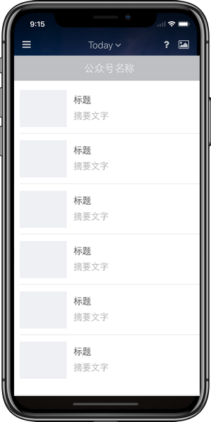
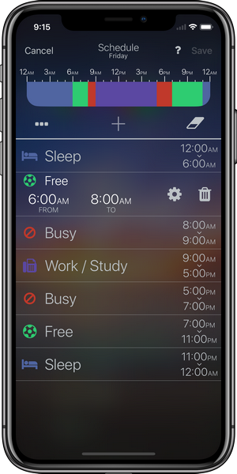
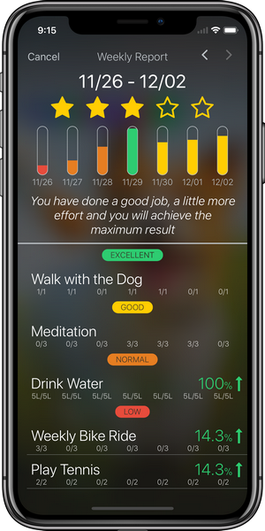
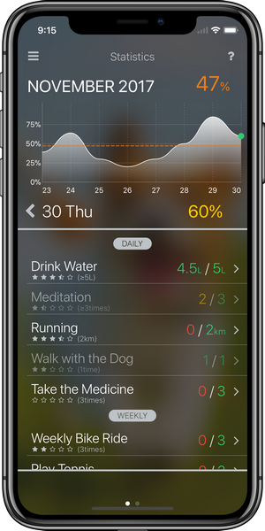
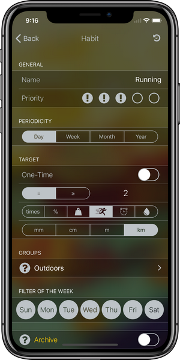

# carousel 轮播图插件

## 使用
- 轮播图的 HTML 结构:
```
<!-- container 包裹层可以自己修改 -->
<div class="container"> 
  <div class="carousel-wrap">
      <!-- data-index 是元素的下标 -->
      
      
      
      
      
      
      
  </div>
  <div class="btn">
    <a href="#" class="carousel-left"></a>
    <a href="#" class="carousel-right"></a>
  </div>
</div>
```
- 引入carousel.js，在入口文件中初始化 carousel 插件即可
```
参数说明
@param {String} itemClassName - 轮播图元素的类名
@param {String} leftClassName - 左按钮元素的类名
@param {String} rightClassName - 右按钮元素的类名

// 轮播图的初始化
carousel.init(itemClassName, leftClassName, rightClassName);
```
